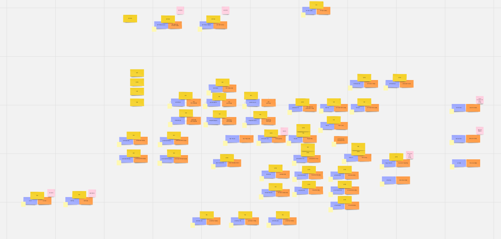

# Boot-up
## 프로젝트 소개
서비스를 계획하고 그 서비스를 위한 설계를 진행하는 과정.

### 아이디어 선정
커피(음료) 예약, 마트 동선 최적화, 세계 맛집 리뷰 등의 의견이 나왔고 그 중에서 세계인들의 맛집 리뷰를 제공하여 외국인들도 한국 음식 중에서 자국의 여행자들이 남긴 리뷰를 통해서 실패하지 않는 맛집을 찾아갈 수 있도록 정보를 제공하는 서비스가 채택이 되었다.

### 아이디어 구체화
외국인들이 사용할 서비스이기 때문에 다음과 같은 기능이 필요했다.
- 번역 기능: 언어를 선택하여 선택한 언어로 서비스를 제공하는 기능
- 환율 변환 기능: 대략적으로 가격을 측정할 수 있도록 선택한 통화로 음식의 가격을 볼 수 있는 기능
- 메뉴판 이미지 번역 기능: OCR 기능과 번역기능을 통해 외국인에게 자국의 언어로 된 메뉴판 정보를 제공하는 기능

### 브레인 스토밍
도메인과 도메인간에 어떤 기능과 역할이 필요한지 miro.com 으로 브레인 스토밍을 진행하였다.
그 후에 필요한 기능과 그 기능을 동작하는 주체 그리고 동작 완료 후를 그룹화하여 눈에 띄는 작업르 하였다. 

### ERD 설계
처음에는 어떻게 ERD를 설계할까 싶었는데 draw.io 에서 각자가 테이블을 만든 후 github 프로젝트 내에 파일을 저장하고 만들어진 파일을 합하는 과정을 거쳤다. 내 생에 첫 ERD 다이어그램을 그리는데 여러 팀원들과 팀장님이 자세히 설명해주셔서 내가 맡은 테이블을 무사히 그릴 수 있었던 것 같다.

---
부트업 2일차가 끝나고는 새로운 조에 편성되어 이전의 팀원이 하던 작업을 이어받아서 설계를 완성해나야 했다.
이번에 속한 조는 evereat이라는 프로젝트였고 회사 내 여러 사람들과 식당을 함게 예약하는 서비스를 만드는 프로젝트를 이어받았다.

### wireframe 작성
이전 팀원들이 작성한 문서와 팀장님의 자세한 설명으로 프로젝트를 쉽게 이해할 수 있었다.
나는 피그마를 사용하여 와이어프레임을 그렸는데 단순히 버튼과 이미지 텍스트를 사각형으로 표현해 화면의 이동을 단순하게 표현하였다. 다른 사람들은 사진과 아이콘들을 활용하였는데 확실히 눈에 더 잘 들어오는 느낌이 들었다.

팀원분의 의견을 통해 와이어프레임과 유즈케이스 기능을 합쳐서 하나로 보여주는 작업을 하였다. 시간이 없을 때 따로 하는 방법보다 두 마리 토끼를 한꺼번에 잡자는 아이디어가 좋아보였다.

### api 작성
api에 구현도 처음 해봐서 어떻게 해야할지 몰랐지만 팀원들이 금방 배울 수 있다면서 자신감을 불어넣어줬다. 그 결과물이 아래와 같다.

지금 다시보니 pathvariable이나 query parameter도 표시하지 않는 등 문제가 많아 보인다. 저때는 만들면서도 뭐가 잘못됐는지 잘 몰랐지만 지금은 그래도 어느정도는 눈에 보인다는 점이 다행인 것 같다.

## 회고
그렇게 3일의 부트업 기간이 끝났다.
여러 사람들이 하나의 다같이 협업하고 다함께 하나의 아이디어를 위해 회의하고 잘 모르는 부분은 친절하게 알려주면서 다 같이 하나한 알아가는 경험을 한 점이 정말 새롭게 느껴졌다. 대학의 조별과제에서 팀에 참여하지 않아 발생하는 어려움을 여기서는 찾아볼 수 없는 것 같았다. 다들 열심히 하고 다 같이 성장하려는 의지가 느껴지는 것 같았다. 
다만 한 가지 아쉬운 점은 내가 너무 준비가 부족하고 지식이 부족하여 팀에 기여를 거의 못했다는 점이다. 지식과 도구들이 너무 많아서 더욱 많은 공부를 해야겠다는 생각이 들었다.
